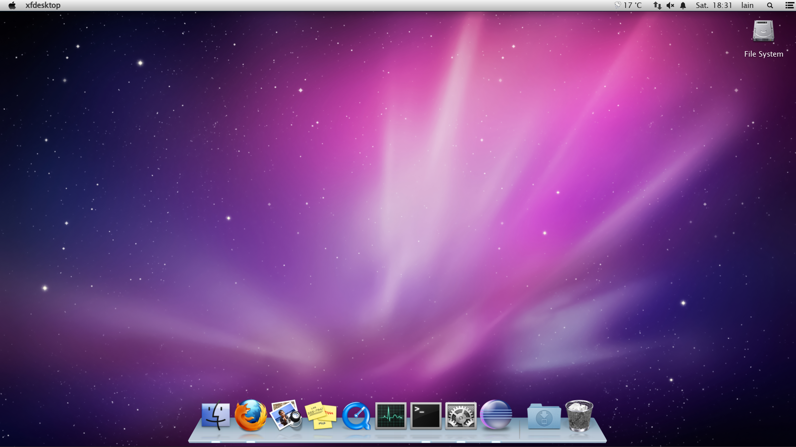

# OSDockX


A friendly, glossy dock for Linux/X11, inspired by the bright desktop style of the 2008–2013 era.



OSDockX keeps your favourite apps, running windows, notifications, and a little bit of sparkle within easy reach. It is built in Rust and currently focused on XFCE

X11 is currently only supported, maybe I will do Wayland one day

## Get started

From this folder, run:

```sh
./install.sh
```

This builds OSDockX and installs it to `~/.local/bin`, along with an application launcher. On first launch, it will ask whether it should start automatically when you log in.

To try it without installing, run:

```sh
cargo run
```

To remove a user-local install later:

```sh
./install.sh --uninstall
```

## A closer look

The default Leopard-style theme brings icon magnification, reflections, running indicators, and notification badges to the shelf.


## Also check out

OSDockX is part of the [pruefsumme](https://github.com/pruefsumme) desktop set. Pair it with [OSNotificationX](https://github.com/pruefsumme/OSNotificationX), a matching XFCE notification center, or [OSXfce](https://github.com/pruefsumme/OSXfce), the complete XFCE setup.

## Independent project

OSDockX is an independent Linux desktop project. It is not affiliated with, endorsed by, or sponsored by Apple Inc. Apple and Mac are trademarks of Apple Inc.
